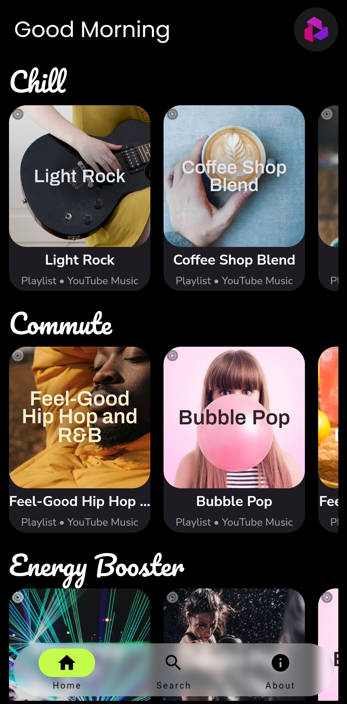
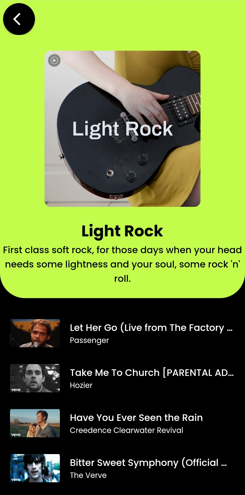
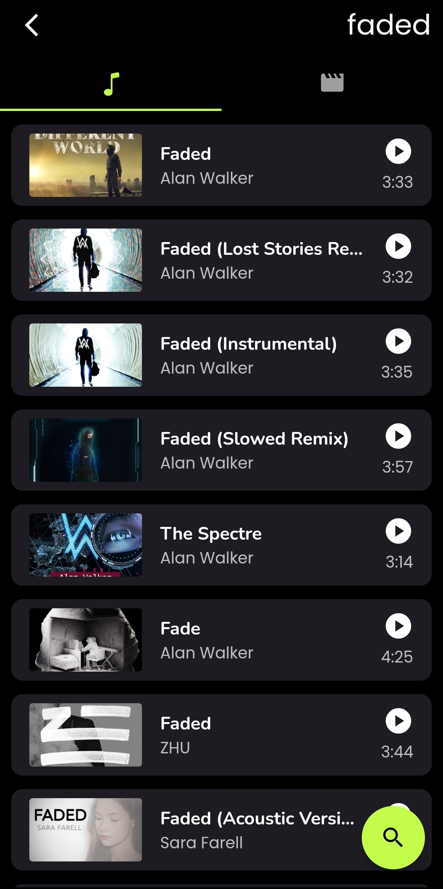

<h1 align="center">
    Musico
</h1>

<div align="center">
  
</div>

Musico is a versatile and user-friendly music streaming platform that leverages the YouTube Music API to provide users with access to a vast library of songs and playlists. This application allows users to search for their favorite songs, discover new music, and access a large number of playlists.

## Screenshots

<p align="center"> 
  
  
  
  
</p>

## Installation

Install project dependencies

```bash
  flutter pub get
```

Run project using this command

```bash
  flutter run -d device_name
```

Build the project using this command

```bash
  flutter build apk --no-tree-shake-icons
```

To install the apk

```bash
  flutter install -d device_name
```
